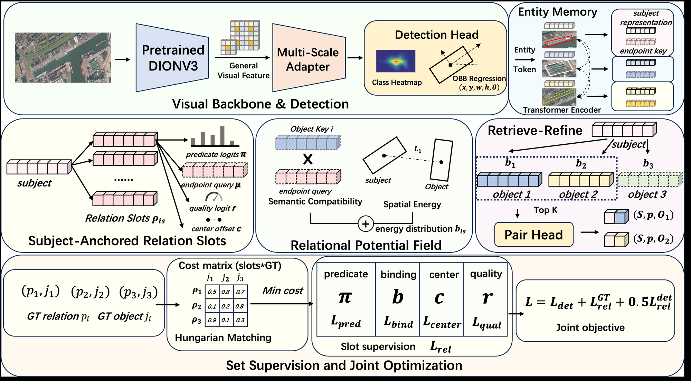
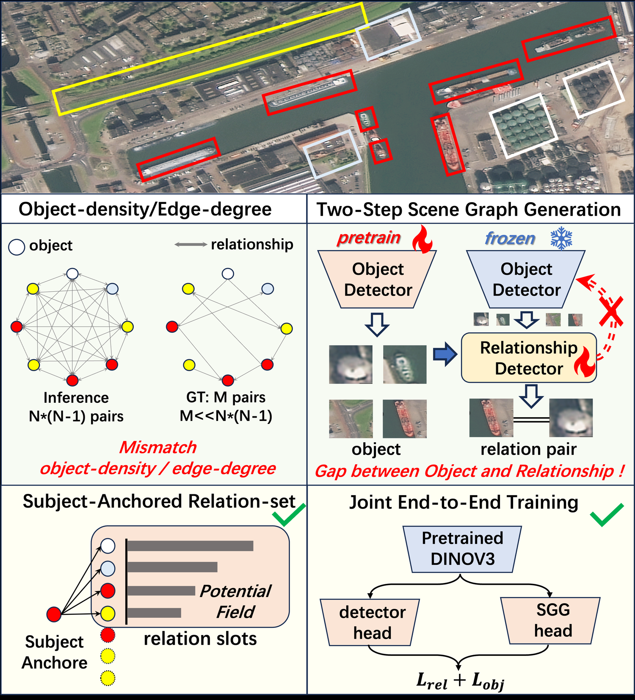
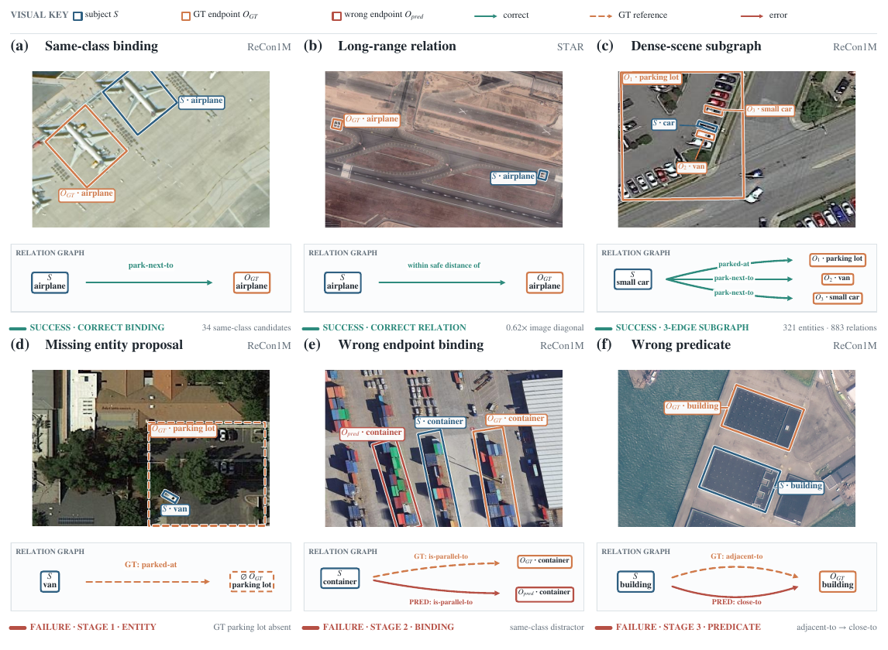

<h1 align="center">RPF-SGG</h1>

<h3 align="center">Subject-Anchored Relation Set Prediction via Relational Potential Fields<br>for Remote Sensing Scene Graph Generation</h3>

<p align="center">
  <a href="mailto:yanqiwei22@mails.ucas.edu.cn">Qiwei Yan</a> ·
  Zhongyan Hou ·
  Boqian Lin ·
  Hongfeng Yu ·
  <a href="mailto:dengcb@aircas.ac.cn">Chubo Deng</a><sup>*</sup>
</p>

<p align="center">
  Aerospace Information Research Institute, Chinese Academy of Sciences
  <br>
  <em>Manuscript under review at IEEE Transactions on Geoscience and Remote Sensing</em>
  <br>
  <sup>*</sup> Corresponding author
</p>

<p align="center">
  
  
  
  
</p>

<p align="center">
  <a href="#overview">Overview</a> &nbsp;·&nbsp;
  <a href="#main-results">Results</a> &nbsp;·&nbsp;
  <a href="#model-zoo">Model Zoo</a> &nbsp;·&nbsp;
  <a href="#evaluation">Evaluation</a>
</p>

<p align="center">
  
</p>

<p align="center"><em>RPF-SGG represents directed relations as a compact subject-anchored set, retrieves endpoints through relational potential fields, and jointly optimizes detection and graph generation.</em></p>

## Overview

Remote sensing scene graph generation must localize oriented entities and infer
directed relations in crowded imagery. Existing pair-centric pipelines reason
over every ordered object pair and commonly separate detector training from
relation learning. This organization is poorly matched to remote sensing
graphs, where entities are dense but annotated relations are sparse.

RPF-SGG introduces an endpoint-explicit, subject-anchored relation-set
predictor. Each retained subject emits a small unordered set of relation slots;
each slot predicts a predicate and a semantic-spatial potential field over
shared entity endpoints. A lightweight retrieve-refine stage then applies an
expressive pair head only to the most plausible endpoint alternatives.

### Key ideas

- **Subject-anchored relation sets.** Replace exhaustive ordered-pair reasoning
  with a fixed slot budget aligned with the sparse out-degree structure.
- **Relational potential fields.** Combine semantic compatibility and oriented
  spatial energy to bind each relation slot to a shared object endpoint.
- **Retrieve and refine.** Preserve efficient global retrieval while retaining
  expressive pairwise reasoning on only the top endpoint candidates.
- **Fully joint optimization.** Train all task-specific detection and graph
  components together from the first update, using only a generic pretrained
  DINOv3 visual backbone.

<p align="center">
  
</p>

<p align="center"><em>RPF-SGG directly addresses the object-density–edge-degree mismatch and removes the detector-first optimization gap.</em></p>

## Main Results

<table align="center">
  <tr>
    <td align="center"><strong>47.22</strong><br>R@500</td>
    <td align="center"><strong>33.40</strong><br>mR@500</td>
    <td align="center"><strong>+17.22</strong><br>R@500 gain</td>
    <td align="center"><strong>+16.50</strong><br>mR@500 gain</td>
    <td align="center"><strong>42.923M</strong><br>parameters</td>
  </tr>
</table>

ReCon1M test-set SGDet under the official graph-constrained protocol:

| Method | R@20 | R@50 | R@100 | R@500 | mR@20 | mR@50 | mR@100 | mR@500 |
| --- | ---: | ---: | ---: | ---: | ---: | ---: | ---: | ---: |
| **RPF-SGG** | **26.36** | **32.76** | **37.41** | **47.22** | **20.23** | **24.66** | **27.65** | **33.40** |

The released checkpoint and evaluator reproduce the full 9,168-image test run:
`R@500 = 47.2210` and `mR@500 = 33.3987` before rounding.

## Qualitative Results

<p align="center">
  
</p>

<p align="center"><em>Representative same-class binding, long-range reasoning, dense-scene subgraphs, and stage-wise failure cases.</em></p>

## Model Zoo

| Dataset | Task | Backbone | Params | R@500 | mR@500 | Checkpoint |
| --- | --- | --- | ---: | ---: | ---: | --- |
| ReCon1M | SGDet | DINOv3 ConvNeXt-Tiny | 42.923M | 47.22 | 33.40 | [Download](https://github.com/KivingY/RPF-SGG/releases/download/v1.0.0/rpf_sgg_recon1m_sgdet.pth) |

Place the checkpoint at `checkpoints/rpf_sgg_recon1m_sgdet.pth`.

<details>
<summary><strong>Checkpoint integrity and license</strong></summary>

SHA-256:

```text
7d88a88c1108d97e8f23aff487482e68683cb96aa52489f4d9fbf56617694259
```

The checkpoint contains the complete inference model, including the DINOv3
ConvNeXt-Tiny backbone, and therefore requires no upstream weight download.
Its DINOv3-derived parameters remain subject to the
[DINOv3 License](THIRD_PARTY_LICENSES/DINOv3_LICENSE.md).

</details>

## Evaluation

### 1. Installation

```bash
git clone https://github.com/KivingY/RPF-SGG.git
cd RPF-SGG
python -m pip install -r requirements.txt
```

Python 3.10+ and CUDA are recommended. The accelerated rotated-IoU operator is
compiled automatically on first use.

### 2. Prepare ReCon1M

Download ReCon1M from its official distribution and build the local train and
test caches:

```bash
python tools/prepare_recon1m.py --data-root /path/to/ReCon1M-cropped
```

<details>
<summary><strong>Expected dataset layout</strong></summary>

```text
ReCon1M-cropped/
├── train/
│   ├── train_r.json
│   ├── rel_r.json
│   └── images/
└── test/
    ├── test_r.json
    ├── rel_r.json
    └── images/
```

The train cache is used only to compute the fixed predicate prior in the paper's
SGDet decoder.

</details>

### 3. Reproduce the paper results

Single GPU:

```bash
python tools/eval_recon1m.py
```

Eight GPUs, matching the reported evaluation setup:

```bash
torchrun --standalone --nproc-per-node=8 tools/eval_recon1m.py
```

The complete evaluation protocol is fixed in
[`configs/recon1m_eval.yaml`](configs/recon1m_eval.yaml). Results are written to
`outputs/recon1m_sgdet.json`.

## Citation

Citation information will be added when the manuscript becomes publicly
available.

## Acknowledgments

This work is supported by the National Natural Science Foundation of China
(42301437). We thank the authors of ReCon1M and DINOv3 for making their data and
models available to the research community.

## License

The RPF-SGG source code is released under the [Apache License 2.0](LICENSE).
ReCon1M remains subject to its own distribution terms. The released checkpoint
contains DINOv3-derived parameters and is distributed subject to the
[DINOv3 License](THIRD_PARTY_LICENSES/DINOv3_LICENSE.md).

For questions, please contact
[Qiwei Yan](mailto:yanqiwei22@mails.ucas.edu.cn).
